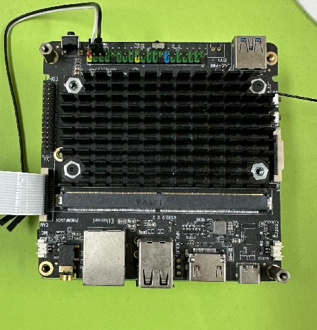
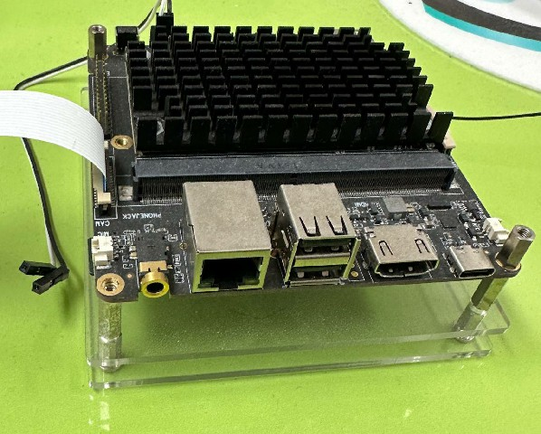
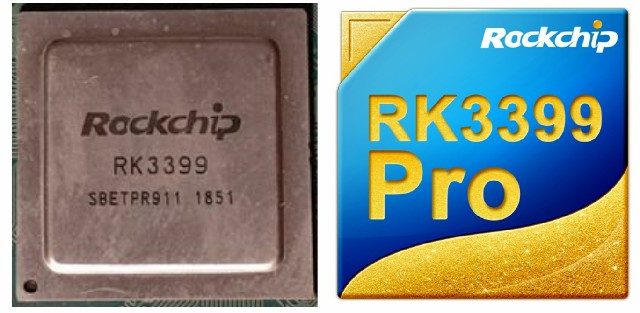
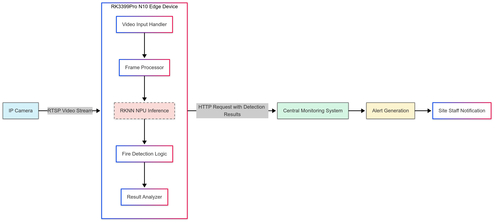

# RK3399Pro Fire Detection System

## Short Description
A project leveraging the Rockchip RK3399Pro device for real-time fire detection in industrial and construction environments, achieving over 90% accuracy with high-speed processing at 20 FPS. This solution employs the edge device's Neural Processing Unit (NPU) for efficient on-site monitoring without requiring cloud connectivity.

## Key Features/Technologies
* **Deep Learning Training**: Employed PyTorch with the YOLOv7 model for fire detection training.
* **Model Conversion Pipeline**: Converted PyTorch models to ONNX format, and subsequently from ONNX to RKNN using the RKNN tool 1.7.3.
* **Edge Device Optimization**: Optimized for running inferences on the RK3399Pro's NPU, achieving 20 FPS with over 90% accuracy.
* **Alert System Integration**: Automated HTTP request generation to Central Monitoring Systems upon fire detection.

## Hardware Overview

### RK3399Pro N10 Development Board
<figure>
  
  <figcaption> RK3399Pro N10 development board  with heatsink and I/O ports </figcaption>
</figure>

<figure>
  
  <figcaption>RK3399Pro N10 development board</figcaption>
</figure>

<figure>
  
  <figcaption>RK3399Pro chipset logo</figcaption>
</figure>

## Fire Detection Demonstration

<video controls width="100%">
  <source src="media/fire_detection_demo.mp4" type="video/mp4">
  Your browser does not support the video tag.
</video>
*15-second demonstration of the fire detection system in action*

## Detailed Explanation

### Deep Learning Training
* **Model**: Utilized the YOLOv7 model for training fire detection.
* **Framework**: PyTorch was the framework used for training due to its flexibility and support for state-of-the-art models.
* **Training Environment**: Training was conducted on a high-performance GPU system to expedite the process and achieve accurate results.
* **Dataset**: Custom dataset including various fire scenarios in both indoor and outdoor industrial environments.

### Model Conversion
* **ONNX Conversion**: The trained PyTorch model was first converted to ONNX format, providing a standardized intermediate representation.
* **RKNN Conversion**: Using RKNN tool 1.7.3, the ONNX model was further converted to RKNN format. This step was crucial for enabling the model to run on the RK3399Pro's NPU.
* **Optimization Process**:
  * Quantization applied to reduce model size and improve inference speed
  * Layer fusion for optimized execution on the NPU
  * Parameter tuning for balance between accuracy and performance

### Edge Device Optimization
* **NPU Inference**: The RK3399Pro's NPU was leveraged to perform efficient and real-time fire detection.
* **Performance Tuning**: Optimized for 20 FPS operation while maintaining accuracy above 90%.
* **Environmental Adaptation**: Model fine-tuned to handle varying lighting conditions in both indoor and outdoor settings.
* **Network Integration**: Configured for seamless connectivity to IP cameras and alert systems.

### Fire Detection Application
* **Deployment Environment**: Successfully implemented in both indoor and outdoor settings at industrial sites and construction areas.
* **Performance Metrics**: 
  * Consistent 20 FPS detection rate across varying conditions
  * Over 90% detection accuracy after training to reduce false positives
  * Sub-second latency from detection to alert generation
* **Alert System Integration**: 
  * Edge device connected to IP cameras via network infrastructure
  * Automatic HTTP request generation to Central Monitoring System (CMS) upon fire detection
  * Immediate alerting capability for rapid emergency response

## Challenges and Learnings
* **Documentation Barriers**: Limited English resources for the RK3399Pro device required navigating Chinese documentation using translation tools.
* **Model Optimization**: Balancing detection accuracy with real-time performance requirements demanded extensive experimentation with model parameters and quantization techniques.
* **False Positive Reduction**: Fine-tuning the model to distinguish between actual fires and visually similar phenomena (sunlight reflections, red lights, etc.) required careful dataset curation and model training.
* **Environmental Adaptability**: Ensuring reliable detection across varying lighting conditions and environments presented significant challenges that were overcome through comprehensive training data collection.

## System Architecture

*System architecture diagram showing the data flow from camera input through the RK3399Pro to the alert system*

## Usage Instructions

### Setup Requirements
* RK3399Pro N10 development board
* IP camera with RTSP stream capability
* Network connectivity for alert transmission
* Central Monitoring System with HTTP request handling capability

### Installation Steps
1. Flash the provided system image to the RK3399Pro device
2. Configure network settings for camera connectivity
3. Set up HTTP endpoint information for the alert system
4. Start the detection service and verify camera feed

### Configuration Options
* Detection sensitivity threshold adjustment
* Alert frequency configuration
* Camera stream parameters
* Log level settings

## Related Projects
[RK3399Pro Fire Detection System](https://github.com/nodirbekDL/nx_vms_edge) - Standalone edge AI implementation using the same RK3399Pro device for fire detection, which evolved into this distributed architecture approach.
